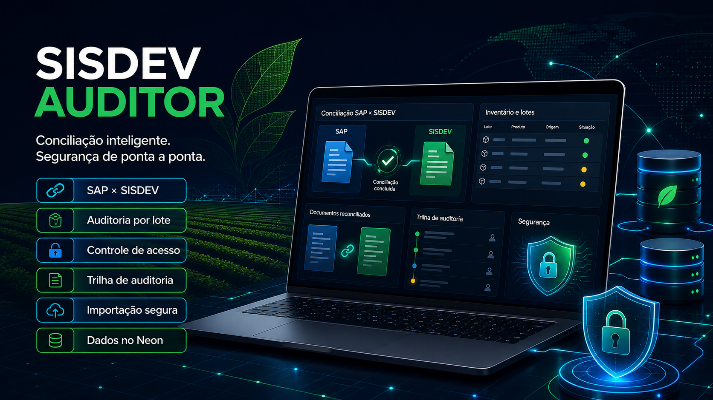

# SISDEV AUDITOR

Aplicação web para auditoria, conciliação e preparação operacional de lançamentos entre SAP, SISDEV e Agrotis. O sistema identifica documentos pendentes ou divergentes, prioriza o lote do fabricante e prepara a fila “Regularizar SISDEV” para conferência humana.

> O SISDEV AUDITOR não realiza lançamentos automáticos no SISDEV.



## Versão — 13 setembro de 2026

Esta versão consolida a evolução da aplicação para uma plataforma protegida de análise, auditoria e orientação operacional. Está publicada em [sisdev-auditor.vercel.app](https://sisdev-auditor.vercel.app/).

Principais melhorias entregues:

- login seguro com sessão revogável, logout, proteção CSRF e limitação de tentativas;
- perfis `ADMINISTRADOR`, `GESTOR`, `AUDITOR`, `OPERADOR` e `CONSULTA`;
- autorização validada no backend por perfil, permissão e escopo;
- criação e administração de usuários restritas ao painel do administrador;
- escopos de acesso por centro, unidade e propriedade;
- paginação de tabelas com 25, 50, 100 e 250 registros por página;
- filtros combinados por período, centro, operação, status e NF-e;
- exportação filtrada em CSV e XLSX com proteção contra CSV Injection;
- Pendências com situação estruturada, diagnóstico, ação recomendada e confiança;
- Regularizar SISDEV como fila inteligente consolidada por NF, com dados operacionais completos sob demanda;
- cálculo inteligente do saldo: `OK`, `SALDO_PARCIAL` e `SEM_SALDO`;
- trilha de auditoria para autenticação, importação, exportação, cadastros, mapeamentos e tratamento de pendências;
- uploads validados e arquivos originais privados no Vercel Blob;
- backup privado de configurações com verificação e restauração administrativa;
- processamento assíncrono por fonte com Vercel Workflow e progresso persistido no Neon;
- Fluid Compute habilitado e fontes grandes divididas em etapas duráveis de até 5.000 linhas, com checkpoints internos a cada 1.000 registros;
- classificação preparatória `CANDIDATO_AUTOMACAO` ou `REVISAO_HUMANA`, sem executar ações críticas automaticamente.

Validação local desta versão: **58 testes automatizados aprovados**, incluindo retomada durável de importações, agrupamento por NF/lote, detalhamento sob demanda, validação das receitas escolhidas, autorização, isolamento por centro, ownership de importações e auditoria das decisões.

### Reforço de segurança desta versão

- consultas de estoque, movimentações, unidades de medida, histórico, opções e alertas do dashboard agora respeitam o escopo de centro no backend;
- pendências não podem ser tratadas por ID quando pertencem a um centro fora do escopo do usuário;
- jobs e ciclos de importação possuem proprietário e fotografia dos centros/propriedades autorizados;
- endpoints de consulta, reprocessamento e conciliação de jobs aplicam ownership para usuários não administradores;
- exportações validam simultaneamente a permissão `export` e o acesso ao módulo solicitado;
- a validação de sessão separa explicitamente o ID da sessão do ID do usuário, preservando a identidade correta nas regras e logs;
- a chave de sessão previsível foi removida; produção e staging falham ao iniciar sem `SISDEV_SECRET_KEY`;
- o entrypoint local/Procfile usa a API Flask autenticada, e o servidor HTTP legado ficou desativado por padrão e limitado a loopback;
- migrações idempotentes adicionam ownership e índices de segurança aos jobs e ciclos existentes.

O relatório técnico detalhado da auditoria é mantido como documento interno e não é publicado no repositório público.

## Fluxo operacional

1. O usuário envia cada fonte separadamente na guia **Importar arquivos**.
2. O arquivo original é armazenado no Vercel Blob.
3. A API registra um `import_job` no Neon e devolve o `job_id`.
4. O botão **Processar esta fonte** inicia um Vercel Workflow assíncrono.
5. Cada execução durável avança no máximo 5.000 linhas e grava checkpoints no Neon a cada 1.000 registros.
6. Se uma execução for interrompida, o Workflow retoma automaticamente do último cursor confirmado, sem duplicar linhas já persistidas.
7. A interface consulta o job e mostra `Aguardando`, `Processando`, `Concluído`, `Concluído com alertas` ou `Falhou`.
8. Depois das oito fontes obrigatórias, **Conciliar fontes concluídas** executa a conciliação em uma etapa separada.
9. Dashboard, páginas e exportações leem somente a execução consolidada no Neon.

O clique HTTP apenas inicia o Workflow. O processamento não fica preso ao tempo da requisição do navegador.

## Fontes de dados

| Etapa | Fonte | Formato |
| --- | --- | --- |
| 1 | SAP — Entradas atuais | `.xlsx` ou `.xls` |
| 2 | SAP — Saídas atuais | `.xlsx` ou `.xls` |
| 3 | SAP — Entrada histórica | `.xlsx` ou `.xls` |
| 4 | SAP — Saída histórica | `.xlsx` ou `.xls` |
| 5 | SAP — Estoque (MB52) | `.xlsx` ou `.xls` |
| 6 | SISDEV — Estoque / Relatório Saldo de Agrotóxico | `.pdf` textual |
| 7 | SISDEV — Movimentações | `.xlsx` ou `.xls` |
| 8 | Agrotis — Receitas | `.xlsx` ou `.xls` |

O upload multipart atual aceita até **4 MB por arquivo**, margem segura para o limite da Function e suficiente para as fontes operacionais atuais. Arquivos maiores deverão usar upload direto do navegador para o Blob.

## Regras implementadas

- SAP é a referência operacional da quantidade.
- Entrada e saída são derivadas da fonte SAP quando a planilha não possui direção explícita.
- NF e série são normalizadas antes da comparação.
- A conciliação considera NF, série, produto, direção, data, centro quando disponível, lote e quantidade.
- Um movimento SISDEV não é reutilizado entre grupos distintos. Quando o SAP divide a mesma NF/produto/lote em várias linhas e o SISDEV consolida o lote em uma única linha, a conciliação compara a soma SAP ao total SISDEV e registra o vínculo agregado de forma rastreável.
- O lote do fabricante é prioritário; divergência desse lote é classificada como divergência, não como correto.
- Quantidade SISDEV é calculada pelo valor absoluto de `embalagens × volume`.
- Linhas exatamente duplicadas da exportação de movimentos SISDEV são removidas antes da conciliação e registradas como alerta.
- Datas brasileiras são interpretadas com dia antes do mês.
- Estoque é comparado por centro, produto, lote do fabricante e unidade.
- Diferença de estoque é `SISDEV - SAP`: positiva necessita saída; negativa necessita entrada; zero está equilibrado.
- Receita de saída é procurada para o mesmo produto em **D ou D-1** da data do documento.
- A preferência de responsável técnico é configurável; o padrão é **KARLA DANIELLY GARCIA DE LIMA**.
- Doses `g/ha` são convertidas para `kg/ha` e `mL/ha` para `L/ha` antes de calcular a área.

Exemplo: `40 L ÷ 0,06 L/ha = 666,67 ha`.

## Funcionalidades

- Dashboard com documentos distintos, eficácia, aderência e distribuição real dos status.
- Dashboard adaptado ao perfil e limitado aos centros, unidades e propriedades autorizados.
- Filtros por período, centro, direção, NF-e, status e preferência de RT.
- Paginação de 25, 50, 100 ou 250 registros, com ordenação e total filtrado.
- Pendências com diagnóstico, ação recomendada, confiança e exportação filtrada em CSV/XLSX.
- Fila operacional **Regularizar SISDEV** consolidada por NF, com prioridade explicável, diagnóstico e ação recomendada.
- Detalhamento sob demanda em árvore: produtos/lotes, receitas possíveis, SAP, SISDEV, conciliação, saldo, retorno/estorno e histórico.
- Seleção humana de uma ou várias receitas, validação do volume total e confirmação/rejeição auditada.
- Status separados para lançamento SAP, situação operacional, conciliação e tratamento humano.
- Notas fiscais, receitas, movimentações e estoques em visões próprias.
- Cadastros/dimensões derivados dos dados importados.
- Mapeamentos persistentes de produto, propriedade/CNPJ, CNPJ-centro/URE, lote fabricante e regras.
- Exportação CSV e XLSX de relatórios e da fila operacional.
- Autenticação, logout, sessão revogável, cinco perfis e autorização também nas APIs.
- Escopo por centro, unidade e propriedade; administrador possui escopo global.
- Trilha de auditoria para login, exportação, importação, mapeamentos, usuários, configurações e tratamento de pendências.
- Histórico de importações, eventos, progresso, alertas e causa amigável de falha.
- Backup privado das configurações, teste de restauração e restauração administrativa confirmada.

### Regularizar SISDEV — saída

A exportação inclui data, CNPJ, NF-e, série, produto, lote, quantidade, volume e quantidade de embalagem, receituário, ART, RT, cultura, diagnóstico, URE, dose e área calculada.

### Fila inteligente e rastreabilidade por NF

A listagem principal apresenta somente o resumo necessário para priorizar o trabalho. Todos os itens da mesma NF, série, CNPJ, direção e centro são agrupados em uma única linha. A fila pode ser ordenada por prioridade, data, NF, status, compatibilidade ou centro.

O botão **Ver detalhe** carrega apenas o documento escolhido e abre a árvore de rastreabilidade. As sugestões de receita recebem um percentual de compatibilidade explicável, considerando produto, NF, janela D/D-1, quantidade, propriedade/CNPJ e RT preferencial. A sugestão nunca confirma automaticamente uma receita.

Para saída, o usuário pode selecionar uma receita ou combinar várias até atingir o volume necessário. O backend rejeita identificadores que não pertencem ao documento e impede a confirmação quando o total selecionado diverge do necessário.

As entradas não utilizam receitas. O emitente da NF define o fluxo operacional:

- `TRANSFERENCIA_RETORNO`: emitente Boa Esperança Agropecuária (nome ou raiz CNPJ `01.722.958`). O detalhe pesquisa todas as saídas anteriores compatíveis com material, lote fabricante e unidade, apresenta as respectivas NFs e permite selecionar as movimentações SISDEV que servirão de referência para o estorno.
- `ENTRADA_FORNECEDOR`: venda de fornecedor externo para a Boa Esperança. A regularização apresenta somente os dados fiscais, material, lote, quantidade e embalagem necessários ao lançamento da entrada.

Nenhum estorno é executado automaticamente: a seleção e a confirmação permanecem sob decisão humana e são registradas na trilha de auditoria.

As decisões correntes ficam em `document_decisions`; cada ação também entra na trilha imutável de `audit_log`, com usuário, data/hora, justificativa e resultado.

## Arquitetura

```text
Navegador
   ├── upload multipart ───────────────> Vercel Blob (arquivo original)
   ├── iniciar/consultar job ──────────> Flask API
   └── consultar dashboard/exportar ──> Flask API
                                          │
                                          ├── Vercel Workflow (processamento e retry)
                                          └── Neon Postgres (jobs, dados e resultados)
```

```text
api/index.py                  API Flask e entrada Vercel
workflow/imports.py           Workflows duráveis de importação e conciliação
src/auditor/database.py       SQLite local / Neon e schema
src/auditor/engine.py         parsers, importação em lote e regras de conciliação
src/auditor/normalization.py  números, documentos, lotes, unidades e texto
src/web/                      interface web estática
sql/import_jobs.sql           migração idempotente do Neon
sql/regularization_queue.sql  fila por NF, decisões humanas e índices de consulta
tests/                        testes de motor, API e orquestração
pyproject.toml                dependências e registro do Workflow Python
vercel.json                   roteamento e limites da Function
```

### Persistência

- `import_runs`: execução consolidada consumida pelo dashboard.
- `import_batches`: ciclo que reúne as oito fontes.
- `import_jobs`: estado, cursor, contadores, tentativas e ID do Workflow por fonte.
- `import_job_events`: histórico do progresso e das falhas.
- `source_records`: linhas normalizadas das fontes enviadas.
- `expected_movements` / `actual_movements`: movimentos SAP e SISDEV.
- `reconciliations` / `audit_issues`: resultado e alertas.
- `document_decisions`: seleção/confirmação/rejeição humana por documento.
- `reconciliation_mappings` / `app_settings`: premissas e mapeamentos configuráveis.

Em produção, `Acompanhamento SISDEV.xlsx` e o PBIX **não são fontes de dados**. A estrutura histórica serviu como referência para regras e colunas; os registros usados são exclusivamente os arquivos enviados e persistidos no Neon.

## API principal

| Método e rota | Função |
| --- | --- |
| `POST /api/upload` | Envia uma fonte ao Blob e cria o job |
| `POST /api/import/{job_id}` | Inicia o Workflow da fonte |
| `GET /api/import/{job_id}` | Consulta progresso e eventos |
| `POST /api/import/{job_id}/retry` | Retoma uma fonte com falha |
| `GET /api/import-jobs/latest` | Restaura o ciclo atual na interface |
| `POST /api/reconcile` | Inicia a conciliação das fontes concluídas |
| `GET /api/reconcile/{batch_id}` | Consulta a conciliação |
| `GET /api/dashboard` | Indicadores, gráficos, filtros e alertas |
| `GET /api/page/{pagina}` | Dados de uma guia |
| `GET /api/export/{csv|xlsx}/{pagina}` | Exportação operacional |
| `POST /api/auth/login` | Autentica e cria uma sessão revogável |
| `GET /api/auth/me` | Retorna usuário, perfil, permissões e escopos |
| `POST /api/auth/logout` | Invalida a sessão no servidor |
| `GET/POST /api/auth/users` | Consulta/criação de usuários pelo administrador |
| `PATCH /api/auth/users/{id}` | Perfil, situação, senha e escopos do usuário |
| `POST /api/pending/{id}/actions` | Registra tratamento humano da pendência |
| `GET /api/regularization/{document_id}` | Carrega a rastreabilidade completa de uma NF sob demanda |
| `POST /api/regularization/{document_id}/decisions` | Salva/confirma/rejeita receitas ou movimentações relacionadas |
| `POST /api/admin/backups` | Cria snapshot privado de configurações |
| `POST /api/admin/backups/{id}/restore-test` | Valida integridade e legibilidade do snapshot |
| `POST /api/admin/backups/{id}/restore` | Restaura snapshot com confirmação e justificativa |
| `GET/POST /api/settings/rt-preference` | Preferência de RT |
| `GET/POST /api/mappings` | Premissas e mapeamentos |
| `GET /api/health` | Saúde básica da API |

## Configuração

Variáveis obrigatórias na Vercel:

```text
DATABASE_URL=<conexão pooled do Neon>
BLOB_READ_WRITE_TOKEN=<token do Vercel Blob>
SISDEV_SECRET_KEY=<segredo aleatório longo para assinar a sessão>
SISDEV_BOOTSTRAP_ADMIN_EMAIL=<usuário ou e-mail do primeiro administrador>
SISDEV_BOOTSTRAP_ADMIN_PASSWORD=<senha inicial forte>
SISDEV_BOOTSTRAP_ADMIN_NAME=<nome opcional>
```

O administrador inicial só é criado quando ainda não existe nenhum usuário. Depois do primeiro acesso, troque a senha inicial e remova `SISDEV_BOOTSTRAP_ADMIN_PASSWORD` do ambiente. Nunca versionar essas variáveis.

Mantenha `DATABASE_URL_UNPOOLED` somente para migrações administrativas quando disponibilizada pela integração Neon. Para desenvolvimento, `SISDEV_DB_PATH` permite usar um SQLite isolado.

### Banco

Antes da primeira publicação da fila, execute no Neon:

```text
sql/import_jobs.sql
sql/security_access.sql
sql/session_audit_hardening.sql
sql/regularization_queue.sql
```

Os scripts são idempotentes e podem ser reaplicados em atualizações de schema. Use conexão direta para a migração e a conexão pooled para a aplicação.

## Desenvolvimento e testes

```powershell
python -m venv .venv
.\.venv\Scripts\python.exe -m pip install -r requirements.txt
.\.venv\Scripts\python.exe -m pytest -q
vercel dev
```

Abra a URL informada por `vercel dev`. Esse comando é o modo local recomendado para testar API e Workflow juntos.

Validações antes de publicar:

```powershell
node --check src\web\app.js
vercel build
vercel deploy
```

Promova para produção somente depois de validar o preview:

```powershell
vercel deploy --prod
```

## Segurança e governança

- Todas as páginas e APIs operacionais exigem sessão válida; mutações também exigem token CSRF.
- A autorização combina usuário, perfil, permissão e escopo e é validada no backend.
- Senhas usam hash `scrypt`; tentativas falhas são registradas e limitadas temporariamente.
- Cookies são `HttpOnly`, `Secure` em produção e `SameSite=Lax`; logout revoga a sessão no banco.
- A sessão expira após 30 minutos sem atividade e possui limite absoluto de 8 horas, mesmo com uso contínuo.
- Arquivos originais são gravados como privados no Blob e suas URLs não são devolvidas nas APIs.
- Uploads validam extensão, assinatura, ZIP XLSX, presença de macros, tamanho, estrutura, colunas e limites de linhas/colunas.
- CSV e XLSX neutralizam células iniciadas como fórmulas.
- Segredos e credenciais permanecem exclusivamente no backend e em variáveis de ambiente.
- Logs de auditoria resolvem o usuário autenticado em `app_users` antes da gravação e não possuem rota comum de exclusão. Uma indisponibilidade secundária do log é registrada tecnicamente, mas não invalida uma exportação já gerada.
- O backup principal do banco é o point-in-time restore do Neon; o sistema adiciona snapshots privados das configurações e um teste explícito de restauração.

Detalhes operacionais estão em `docs/SECURITY_AND_BACKUP.md`.
